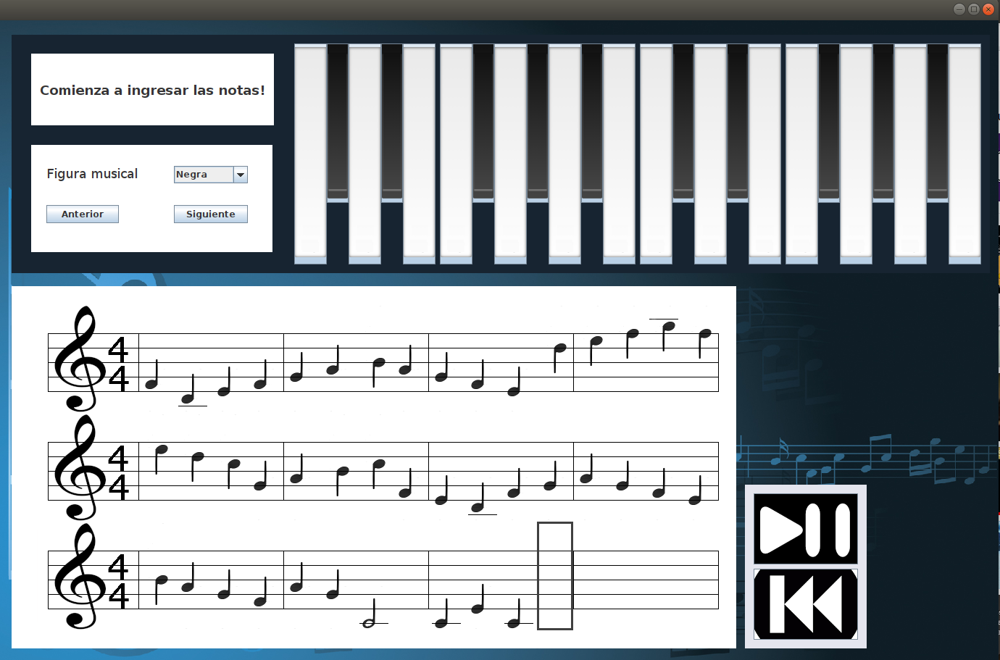

# Foobar

Music notation software created with java



## Installation

copy the repository
and move to base path

```bash
    cd repo/
```

## Usage

```bash
java -jar dist/SimulacionPartitura.jar
```

## Contributing
Pull requests are welcome. For major changes, please open an issue first to discuss what you would like to change.

Please make sure to update tests as appropriate.

## License
[MIT](https://choosealicense.com/licenses/mit/)